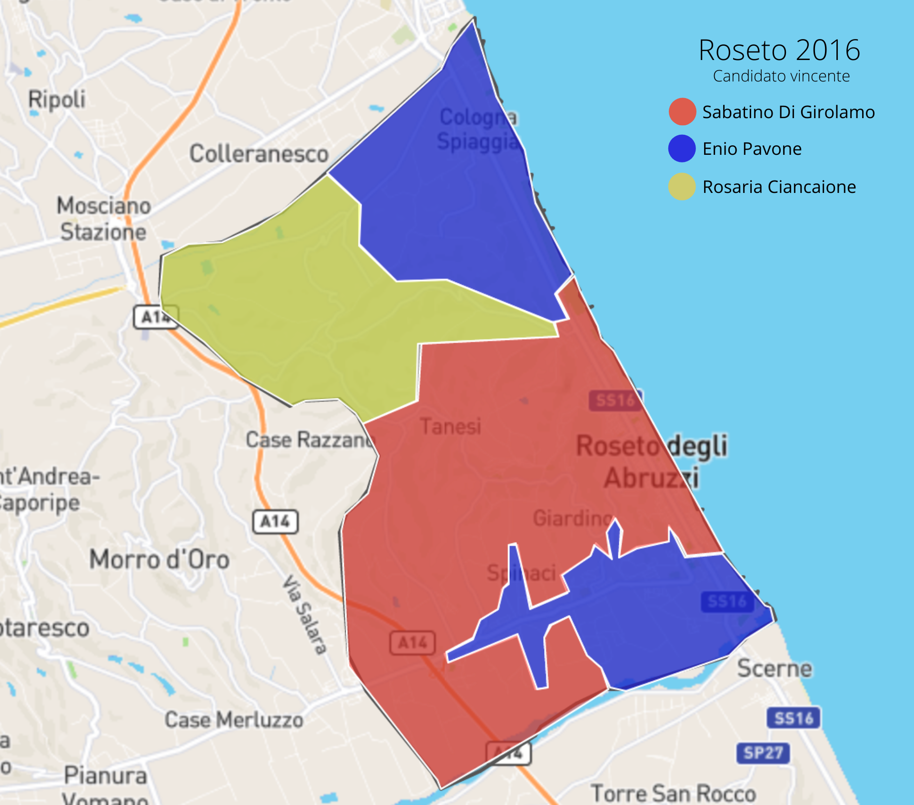

 <div style="width: 100%; overflow: hidden;">
     <div style="width: 100px; float: left;"><a href="https://github.com/Emeierkeio" target="_blank"></a></div>
<div style="margin-right: 0px;"> <b>Mirko Tritella</b><br/> <a href = "mailto: mirkotritella1999@gmail.com" style="font-size:13px">mirkotritella1999@gmail.com</a> <br/> </div>	  
</div>

## Open Data nella città di Roseto degli Abruzzi

### L'importanza del pubblicare dati nel modo giusto

Così come nella gran parte dei comuni italiani, l'amministrazione della città di Roseto degli Abruzzi non ha ancora ben chiara l’importanza di pubblicare i dati in un formato "machine-readable" continuando, al contrario, a condividerli in un formato non riutilizzabile come, ad esempio, il PDF. <br/><br/>
La pubblicazione dei dati di interesse pubblico non è una semplice formalità, al contrario risulta fondamentale affinchè giornalisti, esperti di dati e tutti i cittadini possano estrarli, accedervi con facilità, analizzarli e integrarli con altri dati. <br/>
Per rendere tutto ciò possibile, è necessario pubblicare le informazioni possedute in un formato che sia adatto all'utilizzo di fogli elettronici, applicazioni, database per fare analisi, previsioni e visualizzazioni. <br/><br/>
La speranza è che, al più presto, anche nella nostra città, si possa intraprendere un percorso che abbia come obiettivo la pubblicazione dell'enorme quantità di dati di interesse pubblica quotidianamente prodotta in maniera completamente trasparente e aperta. <br/><br/>
Su [questo sito](http://open.gov.it/) troverete informazioni sulle iniziative portate avanti dal Governo Italiano per la realizzazione del progetto "Open Government".

Ecco, inoltre, le piattaforme di pubblicazione Open Data di alcuni importanti comuni italiani:
 - [Milano](https://dati.comune.milano.it/)
 - [Roma](https://dati.comune.roma.it/)
 - [Bologna](http://dati.comune.bologna.it/)

## Elezioni Comunali 2016


Fonte: <https://www.comune.roseto.te.it/notizie/elezioni/risultati-elettorali-elezioni-comunali-2016> .


---
<p align="center" style="font-size: 18px"><b>ATTENZIONE</b></p> 

<p align="center" style="font-size: 20px">I dati si riferiscono alle elezioni e non al seguente ballottaggio </p>

---

Utilizzando i dati pubblicati sul [sito istituzionale del comune di Roseto degli Abruzzi](https://www.comune.roseto.te.it), ho estratto e trasformato i dati salvandoli nei due formati seguenti:

#### CSV
Il file CSV (Comma-separated values), scaricabile tramite questo [link](https://github.com/Emeierkeio/emeierkeio.github.io/blob/main/data/csv/Comunali2016.csv), è creato in modo da contenere, per ogni sezione, informazioni riguardanti il numero di elettori, schede valide e non valide e preferenze per ogni lista e candidato.

Il file, all'apertura, verrà visualizzato al pari di un file xlsx e quindi analizzabile tramite software come Excel.

Sezione   |Località                       | Elettori| Schede Valide | Enio Pavone (Candidato Sindaco)    | Futuro In |Alessandro Recchiuti| ... |
----------|-------------------------------|---------|---------------|------------------------------------|-----------|--------------------|-----|
1         |Scuola Elementare M. Schiazza  |741      |611            | 137                                | 28        |5                   | ... |
2         |Scuola Elementare M. Schiazza  |919      |623            | 199                                | 45        |17                  | ... |
3         |Scuola Elementare G. D'Annunzio|816      |524            | 173                                | 40        |3                   | ... |
...       | ...                           | ...     | ...           | ...                                | ...       | ...                | ... |
24        |Scuola Elementare M. Schiazza  |886      |525            | 174                                | 36        |3                   | ... |

#### JSON
Allo stesso modo, tramite questo [link](https://github.com/Emeierkeio/emeierkeio.github.io/blob/main/data/json/Comunali2016.json), sarà possibile scaricare il file JSON, un formato adatto all'interscambio di dati fra applicazioni client/server basato sul linguaggio JavaScript, contenente le stesse informazioni.

```json
{
            "id" : 1,
            "località" : "Scuola Elementare M. Schiazza",
            "elettori" : 741,
            "voti" : {
                "validi" : {
                    "numero" : 611,
                    "Enio Pavone" : {
                        "preferenze" : 137,
                        "coalizione" : [
                            {
                                "nome" : "Futuro In",
                                "preferenze" : 28,
                                "candidati" : [
                                    {
                                        "nome" : "Alessandro Recchiuti",
                                        "preferenze" : 5
                                    },
                                    ...
                                ]
                            },
                            ...
                         ]
                      },
                      "Rosaria Ciancaione" : {
                          "preferenze" : 151,
                           "coalizione" : [
                               {
                                   "nome" : "Un'Altra Idea Per Roseto",
                                   "preferenze" : 24,
                                   "candidati" : [
                                       {
                                           "nome" : "Augusto Azzariti",
                                           "preferenze" : 0
                                       },
                                       ...
                                   ]
                               },
                               ...
                           ]
                       },
                       "Sabatino Di Girolamo" : {
                          "preferenze" : 223,
                          "coalizione" : [
                              {
                                  "nome" : "Partito Democratico",
                                  "preferenze" : 119,
                                  "candidati" : [
                                      {
                                          "nome" : "Simone Aloisi",
                                          "preferenze" : 14
                                      },
                                      ...
                                  ]
                              },
                              ...
                          ]
                      },
                    "nonValidi" : {
                        "totale" : 22,
                        "bianchi" : 4,
                        "nulle" : 18,
                        "contestate" : 0
                    }
                }
            }
```
<br/>
<br/>
<br/>

### ESEMPI

---
<p align="center" style="font-size: 18px"><b>ATTENZIONE</b></p> 

<p align="center" style="font-size: 20px">In questa sezione si vuole solamente dare esempi di utilizzo di questi dati, <br/> <u>le valutazioni sono lasciate ai professionisti</u>.</p>

---

Qui di seguito troverete alcuni esempi delle opportunità create dall'analisi dei dati sopra riportati:
<br/>
<br/>
#### QUAL È STATA LA SEZIONE CON IL MAGGIOR TASSO DI ASTENSIONISMO?


<br/>
<br/>


#### ANDAMENTO DELLE COALIZIONI NEL TERRITORIO COMUNALE

La mappa dà una veloce informazione sulla prevalenza territoriale delle coalizioni. <br/>Non dà informazioni sul numero di voti delle altre, in altre parole non dice nulla sul vantaggio del vincitore.
 <br/>
Queste erano le coalizioni che concorrevano nel 2016:
1. Centrodestra (Enio Pavone)
 - Pavone Sindaco (1547)
 - Futuro In (1317)
 - Meloni Fratelli d'Italia (956)
 - Forza Italia Per Pavone (696)
 - Popolari Per Roseto (476)
 - Destra Sociale (111)
2. Amo Roseto (Rosaria Ciancaione)
 - Abruzzo Civico (1375)
 - Roseto Nel Cuore (926)
 - Un'Altra Idea Per Roseto (849)
 - Roseto Progressista (614)
 - Roseto Unita 2016 (382)
 - Roseto Futura (299)
3. Centrosinistra (Sabatino Di Girolamo)
 - Partito Democratico (2823)
 - Di Girolamo Sindaco (914)
 - Roseto Protagonista (505)
<br/>
<br/>
<br/>

 


<br/>
<br/>
<br/>
<br/>

#### IN CHE PERCENTUALI HANNO INFLUITO LE DIVERSE LISTE SUI LORO CANDIDATI?

##### Enio Pavone
<iframe width="800" height="371" seamless frameborder="0" scrolling="no" src="https://docs.google.com/spreadsheets/d/e/2PACX-1vTzca5pgL1oWUaYsCMJEU0HVOq4pXskJ1_LPz7474EZyZBsUV1ZEuyDyAPXH-eHHYc94QBxF-w0D5vF/pubchart?oid=609134946&amp;format=interactive"></iframe>

##### Rosaria Ciancaione
<iframe width="900" height="371" seamless frameborder="0" scrolling="no" src="https://docs.google.com/spreadsheets/d/e/2PACX-1vTzca5pgL1oWUaYsCMJEU0HVOq4pXskJ1_LPz7474EZyZBsUV1ZEuyDyAPXH-eHHYc94QBxF-w0D5vF/pubchart?oid=1578267357&amp;format=interactive"></iframe>

##### Sabatino Di Girolamo
<iframe width="1000" height="371" seamless frameborder="0" scrolling="no" src="https://docs.google.com/spreadsheets/d/e/2PACX-1vTzca5pgL1oWUaYsCMJEU0HVOq4pXskJ1_LPz7474EZyZBsUV1ZEuyDyAPXH-eHHYc94QBxF-w0D5vF/pubchart?oid=1879539561&amp;format=interactive"></iframe>

#### CANDIDATI CON MAGGIOR NUMERO DI PREFERENZE NEL PARTITO DEMOCRATICO
All'interno dei file è possibile trovare il numero esatto delle preferenze ottenute da ogni candidato consigliere in ogni sezione, qui di seguito ho riportato il grafico che raffigura il numero totale di preferenze per ogni candidato del Partito Democratico.
<br/>
<br/>


<br/>
<br/>

#### PREFERENZE AL CANDIDATO SINDACO NEL TERRITORIO COMUNALE

La mappa dà una veloce informazione sulla prevalenza territoriale dei candidati. <br/>Non dà informazioni sul numero di voti degli altri candidati, in altre parole non dice nulla sul vantaggio del vincitore.

1. Sabatino Di Girolamo (5234)
2. Enio Pavone (5082)
3. Rosaria Ciancaione (4242)
<br/>
<br/>
<br/>


<br/>
<br/>
<br/>
<br/>


#### VOTI OTTENUTI DAI MEMBRI DEL CONSIGLIO COMUNALE

---
<p align="center" style="font-size: 18px"><b>ATTENZIONE</b></p> 

<p align="center" style="font-size: 14px">L'elezione a consigliere comunale non dipende esclusivamente dalle preferenze ottenute ma anche da altri fattori.</p>

---

All'interno del grafico non ho tenuto conto dei Candidati Sindaci entrati all'interno del Consiglio comunale.


<br/>
<br/>
<br/>
<br/>


## Risultati delle Elezioni Regionali 2019 a Roseto

Fonte: [Dipartimento per gli Affari Interni e Territoriali](https://elezionistorico.interno.gov.it/index.php?tpel=R&dtel=10/02/2019&tpa=I&tpe=R&lev0=0&levsut0=0&lev1=13&levsut1=1&ne1=13&es0=S&es1=S&ms=S)

Qui di seguito troverete i link dei dati riguardanti i risultati delle elezioni regionali del 2019 nella nostra città.


#### CSV
A questo [link](https://github.com/Emeierkeio/emeierkeio.github.io/blob/main/data/csv/Regionali2019.csv) potrete scaricare il file csv descritto di seguito:

Sezione   |Località                       | Elettori| Votanti       | Bianche                          | Nulle |Partito Democratico Per l'Abruzzo| ... |
----------|-------------------------------|---------|---------------|----------------------------------|-------|---------------------------------|-----|
1         |Scuola Elementare M. Schiazza  |809      |427            | 1                                | 9     |86                               | ... |
2         |Scuola Elementare M. Schiazza  |962      |528            | 3                                | 14    |71                               | ... |
3         |Scuola Elementare G. D'Annunzio|823      |428            | 3                                | 9     |67                               | ... |
...       | ...                           | ...     | ...           | ...                              | ...   | ...                             | ... |
24        |Scuola Elementare M. Schiazza  |901      |452            | 2                                | 8     |60                               | ... |

<br/>

#### JSON
A questo [link](https://github.com/Emeierkeio/emeierkeio.github.io/blob/main/data/json/Regionali2019.json) potrete scaricare il file JSON contenente le seguenti informazioni:

```json
{
            "id" : 1,
            "località" : "Scuola Elementare M. Schiazza",
            "elettori" : 809,
            "votanti" : 427,
            "bianche" : 1,
            "nulle" : 9,
            "candidati" : [
                {
                    "nome" : "Giovanni Legnini",
                    "partiti" : [
                        {
                            "nome" : "Partito Democratico per l'Abruzzo",
                            "preferenze" : 86
                        },
                        ...
                    ]
                },
                {
                    "nome" : "Marco Marsilio",
                    "partiti" : [
                        {
                            "nome" : "Lega",
                            "preferenze" : 97
                        },
                        ...
                    ]
                },
                {
                    "nome" : "Sara Marcozzi",
                    "partiti" : [
                        {
                            "nome" : "Movimento 5 Stelle",
                            "preferenze" : 91
                        }
                    ]
                },
                {
                    "nome" : "Flajani Stefano",
                    "partiti" : [
                        {
                            "nome" : "Casapound Italia",
                            "preferenze" : 3
                        }
                    ]
                }
            ]
        },
```

